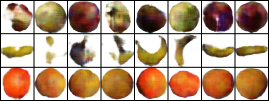
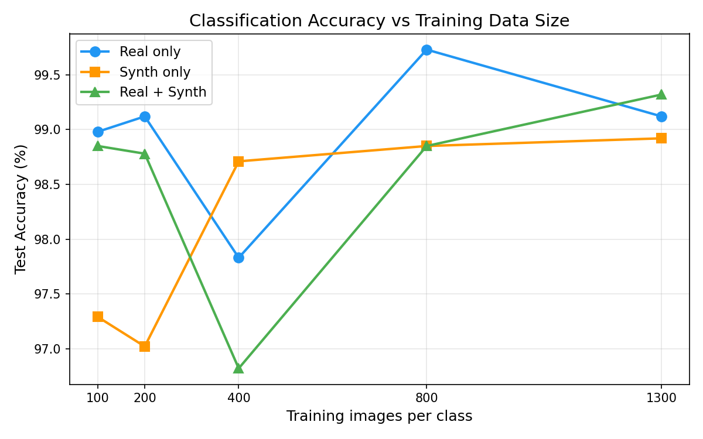
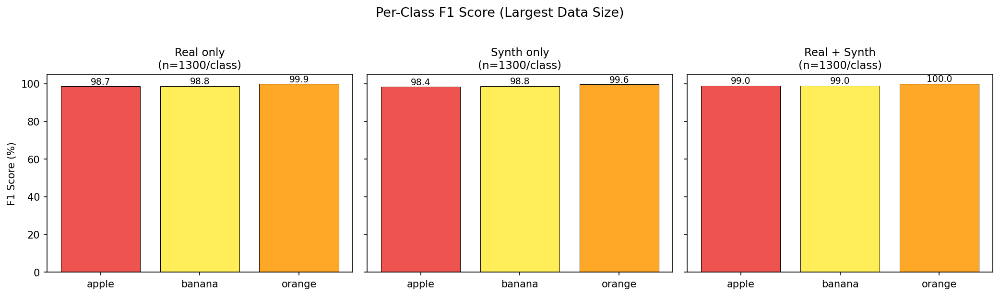

# gan-image-gen

[](LICENSE)
[](https://www.python.org/)
[](https://pytorch.org/)

Conditional Wasserstein GAN with Gradient Penalty (cWGAN-GP) for synthetic fruit image generation, plus a classification pipeline that systematically compares classifiers trained on **real data**, **synthetic data**, and a **combination of both**.

---

## Results

Generated images (epoch 100) — apple · banana · orange:



Test accuracy vs. training set size:



Per-class F1 scores:



Key findings from the 15-experiment grid (5 sizes × 3 scenarios, evaluated on a held-out test set of 492 images/class):

| Images/class | Real-only | Synth-only | Real + Synth |
|:---:|:---:|:---:|:---:|
| 100  | 98.98% | 97.29% | 98.85% |
| 200  | 99.12% | 97.02% | 98.78% |
| 400  | 97.83% | **98.71%** | 96.82% |
| 800  | **99.73%** | 98.85% | 98.85% |
| 1300 | 99.12% | 98.92% | **99.32%** |

- Synth-only consistently reaches within ~1–2% of real-only accuracy, validating the GAN's image quality.
- At 400 images/class, synth-only marginally outperforms real-only — likely a regularisation effect from the GAN's implicit data augmentation.
- Real+Synth reaches peak accuracy (99.32%) at full scale, showing a small but consistent boost when both sources are combined.

---

## Project Structure

```
gan-image-gen/
├── config.py                    # All hyperparameters (GAN + Classifier)
├── models/
│   ├── gan.py                   # Generator (cBN) + ProjectionCritic
│   └── classifier.py            # FruitCNN (from scratch, no transfer learning)
├── train_gan.py                 # WGAN-GP training loop + FID logging
├── train_classifier.py          # Classification: real / synth / both scenarios
├── scripts/
│   ├── generate_synth.py        # Generate synthetic dataset from trained G
│   ├── run_experiments.py       # Full experiment grid (5 sizes × 3 scenarios)
│   └── plot_results.py          # Accuracy/time plots + per-class F1 charts
├── notebooks/
│   └── gan_image_gen_quickstart.ipynb
├── tests/
│   └── test_models.py           # Model shape smoke tests (no training data needed)
├── docs/assets/                 # Sample outputs committed for README
├── data_final/                  # Real dataset — see "Getting the Data" below
└── data_synth/                  # Generated after Step 2
```

---

## Dataset

3 classes: **apple**, **banana**, **orange** (64×64 RGB)

Real images are sourced from the [Fruits 360](https://www.kaggle.com/datasets/moltean/fruits) dataset (subset + splits prepared locally into `data_final/`).
Before redistributing any dataset files, make sure you comply with Fruits 360's license and attribution requirements.

| Split | Per Class | Total |
|-------|-----------|-------|
| Train | 1300      | 3900  |
| Val   | 159       | 477   |
| Test  | 492       | 1476  |

### Getting the Data

1. Download [Fruits 360 from Kaggle](https://www.kaggle.com/datasets/moltean/fruits) and unzip it.
2. Copy the `apple`, `banana`, and `orange` class folders from `fruits-360_dataset/fruits-360/Training/` and `Test/` into the following layout:

```
data_final/
  train/
    apple/
    banana/
    orange/
  val/        ← carve out ~10% from training images
  test/
    apple/
    banana/
    orange/
```

The exact split sizes used here (1300 / 159 / 492 per class) are not required — the code will work with any balanced split. `data_final/` is excluded from git by `.gitignore`.

---

## Setup

```bash
conda create -n gan python=3.11 -y
conda activate gan
pip install -r requirements.txt
```

> **Note:** If `pip install -r requirements.txt` doesn't give you a working GPU build, install PyTorch/torchvision for your CUDA version first from [pytorch.org](https://pytorch.org/get-started/locally/), then install the rest.

---

## Notebook

Open `notebooks/gan_image_gen_quickstart.ipynb` for an end-to-end interactive walkthrough: data sanity checks → small training runs → visualisations.

---

## Usage

A `Makefile` is provided for convenience. Run `make help` to see all targets, or use the steps below directly.

### Step 1 — Train GAN

```bash
python train_gan.py
# or:  make train
```

- cWGAN-GP with projection discriminator
- TTUR: G lr=1e-4, D lr=2e-4, Adam(β1=0.0, β2=0.9)
- n_critic=3, gradient penalty λ=10
- FID computed every 5 epochs on `data_final/val` (no augmentation)
- Checkpoints saved to `runs/gan/checkpoints/`
- Best FID checkpoint saved to `runs/gan/checkpoints/best_fid.pt`
- Sample grids saved to `runs/gan/`
- Training log: `runs/gan/train_log.json`
- Offline-friendly: set `fid_every=0` in `config.py` to disable FID (skips Inception weights download)

### Step 2 — Generate Synthetic Dataset

```bash
python scripts/generate_synth.py \
    --ckpt runs/gan/checkpoints/best_fid.pt \
    --n_per_class 1300 \
    --seed 42
# or:  make generate
```

Fixed seed ensures reproducibility. Run once, then freeze.

### Step 3 — Run Experiment Grid

```bash
python scripts/run_experiments.py
# or:  make experiment
```

Runs 15 experiments (5 data sizes × 3 scenarios):

| Size/Class | Real | Synth | Real+Synth |
|------------|------|-------|------------|
| 100        | ✓    | ✓     | ✓          |
| 200        | ✓    | ✓     | ✓          |
| 400        | ✓    | ✓     | ✓          |
| 800        | ✓    | ✓     | ✓          |
| 1300       | ✓    | ✓     | ✓          |

Results saved to `runs/clf/all_results.json`.

### Step 4 — Generate Plots

```bash
python scripts/plot_results.py
# or:  make plot
```

Outputs to `runs/clf/plots/`:
- `accuracy_vs_size.png` — Test accuracy trend across data sizes
- `time_vs_size.png` — Training time comparison
- `per_class_f1.png` — Per-class F1 scores

---

## Tests

Shape smoke tests for all three models (no dataset needed):

```bash
pytest tests/ -v
# or:  make test
```

---

## Architecture

### Generator (~1.5M params)
- Input: z (128-d) + class label
- 4× GenBlock: Upsample → Conv → ConditionalBatchNorm → ReLU
- Output: 3×64×64, Tanh

### Projection Critic (~4.9M params)
- 4× CriticBlock: Conv → LeakyReLU → Conv → LeakyReLU → AvgPool (with skip)
- Global sum pooling → linear + projection (Miyato & Koyama, 2018)

### Classifier (~813K params)
- 3× (Conv-BN-ReLU × 2 + Pool + Dropout) → AdaptiveAvgPool → FC head
- Trained from scratch, no pretrained weights

---

## Key Config (`config.py`)

| Parameter        | Value  | Description                          |
|------------------|--------|--------------------------------------|
| `img_size`       | 64     | Image resolution (64×64)             |
| `z_dim`          | 128    | Latent dimension                     |
| `gan_batch`      | 64     | GAN batch size                       |
| `gan_epochs`     | 100    | GAN training epochs                  |
| `gan_lr_g`       | 1e-4   | Generator learning rate              |
| `gan_lr_d`       | 2e-4   | Critic learning rate (TTUR)          |
| `n_critic`       | 3      | Critic updates per G update          |
| `gp_lambda`      | 10.0   | Gradient penalty coefficient         |
| `fid_every`      | 5      | FID evaluation interval              |
| `fid_eval_split` | val    | FID real split (no augmentation)     |
| `clf_batch`      | 64     | Classifier batch size                |
| `clf_epochs`     | 30     | Classifier training epochs           |
| `clf_lr`         | 1e-3   | Classifier learning rate             |
| `device`         | auto   | Auto-pick CUDA → MPS → CPU           |

---

## References

- Miyato, T. & Koyama, M. (2018). [cGANs with Projection Discriminator](https://arxiv.org/abs/1802.05637). *ICLR 2018.*
- Gulrajani, I. et al. (2017). [Improved Training of Wasserstein GANs](https://arxiv.org/abs/1704.00028). *NeurIPS 2017.*
- Horea Muresan & Mihai Oltean. [Fruits 360 Dataset](https://www.kaggle.com/datasets/moltean/fruits).

---

## License

[MIT](LICENSE) © 2026 Arda Erdogan
